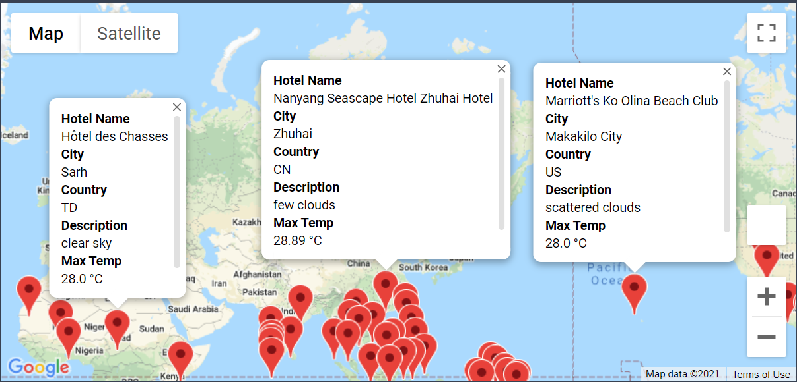
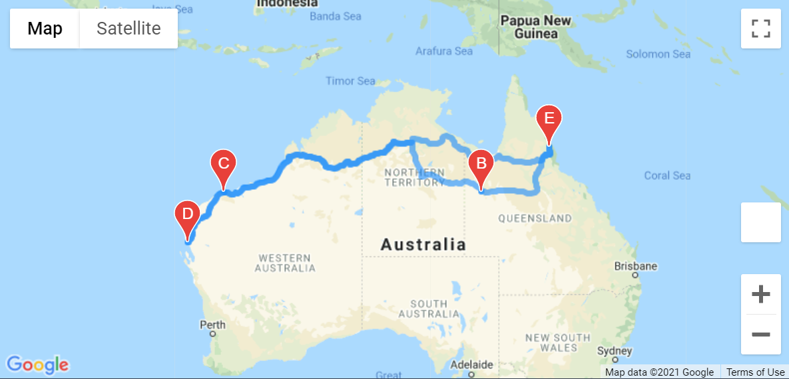

# World Weather Analysis
## Overview of the analysis:
The purpose of this analysis was to build the PlanMyTrip app for users to input their minimum and maximum temperature preferences to identify potential destinations. 

## Results:
At first we generated two thousand pair of latitude and longitude using the `numpy.random.uniform` function. We then searched for the nearest city for each pair of coordinates with the `citipy` module. Using the Open Weather Map API, we retrieved the current weather for each city and assembled the DataFrame and export to a csv file.

In the second part, we used our city csv file to search for matching hotels with the Google map API based on latitude and longitude coordinates. Despite having zero count for empty cells, two hotel rows were empty, so we used the `replace` empty string function before the `dropna`.

```
hotel_df['Hotel Name'].replace('', np.nan, inplace=True)
clean_hotel_df = hotel_df.dropna(axis=0, how='any')
clean_hotel_df.head(10)
```

This gave us a clean list of cities and hotels with potential world destinations where we added a marker and an html tag with the following template:
```
info_box_template = """
<dl>
<dt><b>Hotel Name</b></dt><dd>{Hotel Name}</dd>
<dt><b>City</b></dt><dd>{City}</dd>
<dt><b>Country</b></dt><dd>{Country}</dd>
<dt><b>Description</b></dt><dd>{Description}</dd>
<dt><b>Max Temp</b></dt><dd>{Max Temp} °C</dd>
</dl>
"""
```



In the last part, 4 cities in Australia were picked and an itinerary layer was added to the map with the following code:

```
start = vacation_start["Lat"].to_numpy()[0], vacation_start["Lng"].to_numpy()[0]
end = vacation_end["Lat"].to_numpy()[0], vacation_end["Lng"].to_numpy()[0]
stop1 = vacation_stop1["Lat"].to_numpy()[0], vacation_stop1["Lng"].to_numpy()[0]
stop2 = vacation_stop2["Lat"].to_numpy()[0], vacation_stop2["Lng"].to_numpy()[0]
stop3 = vacation_stop3["Lat"].to_numpy()[0], vacation_stop3["Lng"].to_numpy()[0]

fig = gmaps.figure()
vacation_itinerary = gmaps.directions_layer(
        start, end, waypoints=[stop1, stop2, stop3],
        travel_mode='DRIVING')
fig.add_layer(vacation_itinerary)
fig
```



## Summary:
Overall, this project was a great way to familiarize ourselves with different API syntax including the Open Weather Map and the various Google widgets.
